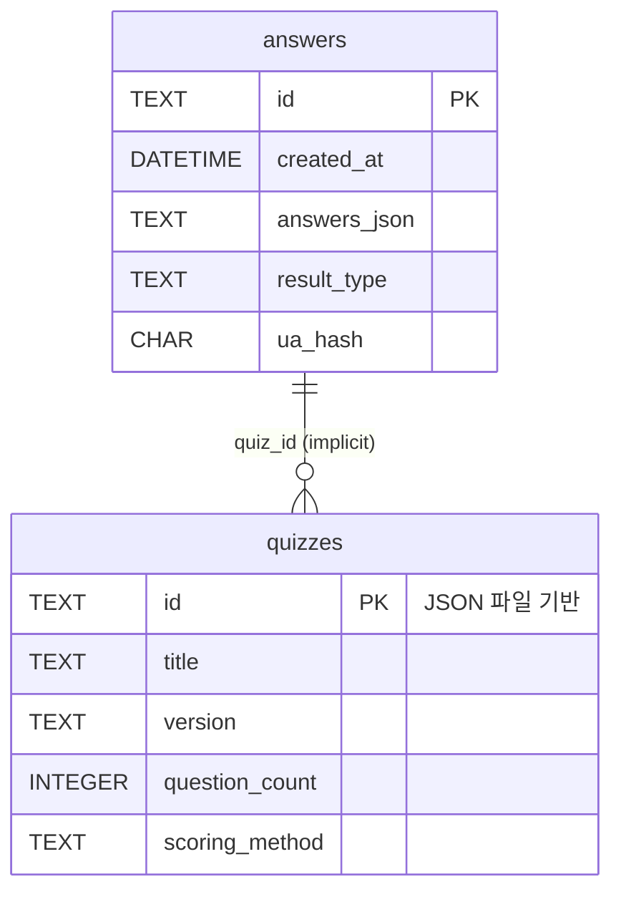

# DB 스키마 v0.2.0

본 문서는 SQLite → Supabase(PostgreSQL)로 이전될 **answers** 테이블의 구조와 데이터 관리 정책을 정의한다.
**Phase 1**: JSON 기반 동적 퀴즈 시스템 지원

## 테이블: answers

| 컬럼 | 타입 | 제약조건 | 설명 |
|------|------|---------|------|
| `id` | TEXT(UUID) | `PRIMARY KEY` | 응답 식별자(UUID4) |
| `created_at` | DATETIME | `DEFAULT CURRENT_TIMESTAMP` | 생성 시각(UTC) |
| `answers_json` | TEXT | `NOT NULL` | 동적 문항 응답(JSON 직렬화) |
| `result_type` | TEXT | `CHECK IN ( '7080','IMF','ACT','DRM','PHONE','ANA','TREND','JUNK' )` | 결과 유형 코드(8종) |
| `ua_hash` | CHAR(64) |  | User-Agent+IP SHA-256 해시(개인 정보 보호) |

```sql
CREATE TABLE answers (
  id          TEXT PRIMARY KEY,
  created_at  DATETIME DEFAULT CURRENT_TIMESTAMP,
  answers_json TEXT NOT NULL,
  result_type TEXT CHECK(result_type IN (
    '7080','IMF','ACT','DRM','PHONE','ANA','TREND','JUNK'
  )),
  ua_hash     CHAR(64)
);
```

### 인덱스
```sql
CREATE INDEX idx_answers_created_at ON answers(created_at);
CREATE INDEX idx_answers_result_type ON answers(result_type);
```

## 데이터 형식 변화 (v0.2.0)

### answers_json 컬럼 확장
Phase 1에서는 동적 퀴즈 지원을 위해 `answers_json` 컬럼이 다양한 형식을 지원합니다:

#### 기존 형식 (하위 호환성 유지)
```json
{
  "q1": "A",
  "q2": "B",
  "q3": "C",
  "q4": "D",
  "q5": "A",
  "q6": "B",
  "q7": "C",
  "q8": "D",
  "q9": "A",
  "q10": "B"
}
```

#### 새로운 JSON 기반 형식
```json
{
  "q1": "q1_a",
  "q2": "q2_b", 
  "q3": "q3_c",
  "q4": "q4_a",
  "q5": "q5_b",
  "q6": "q6_c",
  "q7": "q7_a",
  "q8": "q8_b",
  "q9": "q9_c",
  "q10": "q10_a",
  "q11": "q11_b",
  "q12": "q12_c",
  "q13": "q13_a",
  "q14": "q14_b",
  "q15": "q15_c"
}
```

### 결과 유형 확장
현재 8가지 결과 유형을 지원하며, JSON 퀴즈 정의에서 동적으로 관리됩니다:

- `7080`: 7080 감성형 🎵
- `IMF`: IMF 생존형 💪  
- `ACT`: 운동권 열혈형 ✊
- `MBC`: MBC드라마형 📺 (기존 DRM에서 변경)
- `PHONE`: 폰 적응형 📱
- `ANA`: 아날로그 고수형 📻
- `TREND`: 유행 선도형 ✨
- `JUNK`: 정크컬쳐 수집형 🎬

## 데이터 관리 정책

### 개인정보 보호 (기존 유지)
1. **개인정보 최소화**: IP 원문은 저장하지 않고, UA+IP+SALT를 SHA-256으로 해싱하여 `ua_hash` 컬럼에 저장한다.  
   – SALT는 14일 주기로 교체하며, 교체 후 기존 해시는 유지(로그 연결용).

### 백업 및 보존 (기존 유지)
2. **백업**: SQLite → Supabase 마이그레이션 이후, Supabase 자동 백업 + 월 1회 S3 Snapshot.
3. **삭제 정책**: 응답 데이터는 통계 목적상 1년간 보존 후 삭제한다.
4. **RLS(Row Level Security)**: Supabase 이전 시 `answers` 테이블은 Select/Insert 전용 서비스 Role만 허용, 사용자는 직접 접근 불가.

### 새로운 정책 (Phase 1)
5. **퀴즈 버전 관리**: JSON 퀴즈 파일 변경 시 기존 응답 데이터와의 호환성 유지
6. **동적 필드 지원**: `answers_json`에서 가변 길이 문항 ID 지원 (q1~q15, 향후 확장 가능)

## JSON 퀴즈 파일 관리

### 파일 위치
```
assets/
├── quizzes/
│   ├── mind-age-test.json    # 메인 퀴즈
│   └── *.json                # 향후 추가 퀴즈들
├── schemas/
│   └── quiz-schema-v2.1.json # JSON Schema 검증
└── templates/
    └── *.html                # 동적 템플릿
```

### 퀴즈 메타데이터
각 JSON 퀴즈 파일은 다음 정보를 포함합니다:
- **식별자**: 고유 퀴즈 ID
- **버전**: 시맨틱 버전 (1.0.0)
- **문항 수**: 동적 (현재 15문항)
- **결과 유형**: 8가지 (확장 가능)
- **점수 방식**: simple_count (향후 weighted_sum, percentage 추가)

## ERD(Mermaid)


## 마이그레이션 계획

### Phase 1 → Phase 2
- **새로운 테이블**: `quiz_sessions` (진행 중인 퀴즈 세션 관리)
- **확장 필드**: `quiz_id`, `session_data` 추가 고려
- **분석 테이블**: `analytics_events` (GA4 이벤트 로컬 저장)

### Supabase 이전 시 고려사항
- **JSON 컬럼 타입**: PostgreSQL JSONB 활용으로 성능 향상
- **인덱스 최적화**: JSONB 필드에 대한 GIN 인덱스
- **실시간 기능**: Supabase Realtime으로 실시간 통계 대시보드

---

**문서 변경 이력**
| 버전 | 날짜 | 작성자 | 변경 내용 |
|------|------|--------|-----------|
| 1.0 | 2025-01-21 | o3-assistant | v0.1.0 기준 초기 스키마 설계 |
| 0.2.0 | 2025-01-21 | claude-sonnet | Phase 1 JSON 기반 시스템 반영, 동적 퀴즈 지원 |