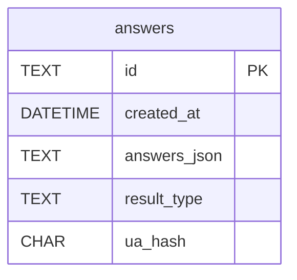

# DB 스키마 v1.0

본 문서는 SQLite → Supabase(PostgreSQL)로 이전될 **answers** 테이블의 구조와 데이터 관리 정책을 정의한다.

## 테이블: answers

| 컬럼 | 타입 | 제약조건 | 설명 |
|------|------|---------|------|
| `id` | TEXT(UUID) | `PRIMARY KEY` | 응답 식별자(UUID4) |
| `created_at` | DATETIME | `DEFAULT CURRENT_TIMESTAMP` | 생성 시각(UTC) |
| `answers_json` | TEXT | `NOT NULL` | 원본 10문항 응답(JSON 직렬화) |
| `result_type` | TEXT | `CHECK IN ( '7080','IMF','ACT','DRM','PHONE','ANA','TREND','JUNK' )` | 결과 유형 코드(8종) |
| `ua_hash` | CHAR(64) |  | User-Agent+IP SHA-256 해시(개인 정보 보호) |

```sql
CREATE TABLE answers (
  id          TEXT PRIMARY KEY,
  created_at  DATETIME DEFAULT CURRENT_TIMESTAMP,
  answers_json TEXT NOT NULL,
  result_type TEXT CHECK(result_type IN (
    '7080','IMF','ACT','DRM','PHONE','ANA','TREND','JUNK'
  )),
  ua_hash     CHAR(64)
);
```

### 인덱스
```sql
CREATE INDEX idx_answers_created_at ON answers(created_at);
```

## 데이터 관리 정책
1. **개인정보 최소화**: IP 원문은 저장하지 않고, UA+IP+SALT를 SHA-256으로 해싱하여 `ua_hash` 컬럼에 저장한다.  
   – SALT는 14일 주기로 교체하며, 교체 후 기존 해시는 유지(로그 연결용).
2. **백업**: SQLite → Supabase 마이그레이션 이후, Supabase 자동 백업 + 월 1회 S3 Snapshot.
3. **삭제 정책**: 응답 데이터는 통계 목적상 1년간 보존 후 삭제한다.
4. **RLS(Row Level Security)**: Supabase 이전 시 `answers` 테이블은 Select/Insert 전용 서비스 Role만 허용, 사용자는 직접 접근 불가.

## ERD(Mermaid)


> ⚠️ 추후 `users` 테이블이 도입될 경우 외래키 관계가 추가될 수 있다. 