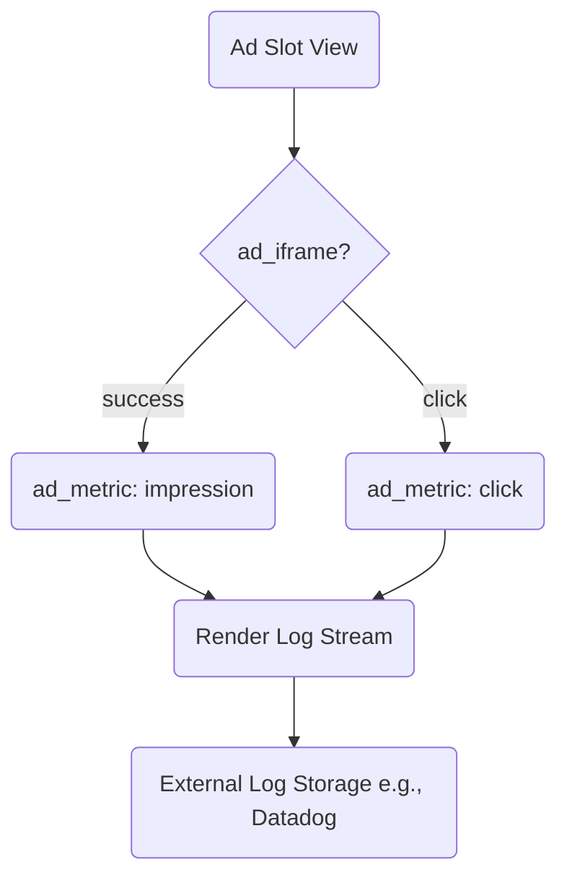

# 광고 연동 가이드 v1.0

이 문서는 Google AdSense, Kakao AdFit 광고를 서비스에 통합하기 위한 절차와 현재 Stub 구현 현황을 설명한다.

## 1. 현재 상태
- `external/adsense_stub.py`, `external/kakao_stub.py` 모듈에서 실제 JS SDK 호출을 모킹하여 테스트·로컬 환경에서도 코드가 실패 없이 동작하도록 구성.
- 결과 페이지(`templates/result.html`) 하단에 **광고 슬롯(div#ad-slot)** 를 삽입하고, Stub의 `render_ad()`가 호출되어 렌더 기록을 남긴다.
- 유닛 테스트(`tests/unit/test_external.py`)에서 Stub이 정상 호출되는지 검증.

## 2. 실제 SDK 전환 계획

| 단계 | 작업 | 세부 내용 |
|------|------|----------|
| ① | 사이트 등록·승인 | - Google AdSense 콘솔 → `https://<domain>` 추가, 메타 태그 삽입 - Kakao AdFit 매체 등록, 1차 검수 완료 후 광고 단위 생성 |
| ② | 코드 삽입 | - `result.html` 하단에 제공된 `` 추가 - 광고 div에 `data-ad-client` / `data-ad-slot` 속성 설정 |
| ③ | 환경 분기 | - `settings.py`에 `ENV=production` 체크 → production에서는 Stub을 import하지 않고 실제 SDK 호출 |
| ④ | 지표 로그 | - `log_ad_metric()` 헬퍼로 `impression`, `click`, `rpm` 등 로그 전송 |
| ⑤ | A/B 테스트 | - AdSense ↔ AdFit 슬롯을 50:50 로테이션, CTR/RPM 비교 |

## 3. 로그 파이프라인

- Stub 단계에서는 `C`, `D`가 로컬 메모리 리스트에 저장된다.
- 프로덕션에서는 structlog JSON → Render Log Stream → Datadog/Loki로 전송 예정.

## 4. 운영 주의사항
1. **클릭 유도 금지**: `adsense_policy_violation` 로그 발견 시 즉시 광고 영역 UX 수정.
2. **레이아웃 시프트**: CLS(Core Web Vitals) 최소화를 위해 광고 div에 고정 높이 지정.
3. **페이지 속도**: 광고 스크립트는 `async` 로딩, 중요한 콘텐츠 이전에 블로킹 JS 삽입 금지.
4. **무료 플랜 한도**: Render 무료 인스턴스 750 h/월 → 트래픽 증가 시 Pro 플랜으로 업그레이드.

## 5. 참고 링크
- [Google AdSense 도움말](https://support.google.com/adsense/)  
- [Kakao AdFit 가이드](https://adfit.kakao.com)  
- Render Log Streams 문서  