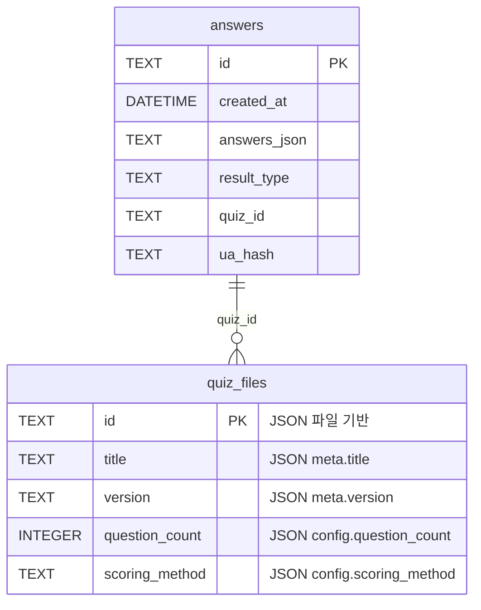

# DB 스키마 v0.2.0 (구현 완료)

본 문서는 SQLite 기반 **answers** 테이블의 구조와 데이터 관리 정책을 정의한다.
**Phase 1**: JSON 기반 동적 퀴즈 시스템 완전 지원 ✅

## 현재 구현 상태

### 구현된 테이블: answers
- **위치**: `nojam.sqlite3` (프로젝트 루트)
- **관리**: `nojam/db/repository.py`의 `AnswerRepository` 클래스
- **연결**: aiosqlite를 통한 비동기 처리

| 컬럼 | 타입 | 제약조건 | 설명 |
|------|------|---------|------|
| `id` | TEXT(UUID) | `PRIMARY KEY` | 응답 식별자(UUID4) |
| `created_at` | DATETIME | `DEFAULT CURRENT_TIMESTAMP` | 생성 시각(UTC) |
| `answers_json` | TEXT | `NOT NULL` | 동적 문항 응답(JSON 직렬화) |
| `result_type` | TEXT | `CHECK IN (...)` | 결과 유형 코드 |
| `quiz_id` | TEXT | `NOT NULL` | 퀴즈 식별자 |
| `ua_hash` | CHAR(64) |  | User-Agent+IP SHA-256 해시 |

```sql
CREATE TABLE IF NOT EXISTS answers (
    id TEXT PRIMARY KEY,
    created_at DATETIME DEFAULT CURRENT_TIMESTAMP,
    answers_json TEXT NOT NULL,
    result_type TEXT NOT NULL,
    quiz_id TEXT NOT NULL,
    ua_hash TEXT
);
```

### 구현된 인덱스
```sql
CREATE INDEX IF NOT EXISTS idx_answers_created_at ON answers(created_at);
CREATE INDEX IF NOT EXISTS idx_answers_result_type ON answers(result_type);
CREATE INDEX IF NOT EXISTS idx_answers_quiz_id ON answers(quiz_id);
```

## 데이터 형식 (현재 구현)

### answers_json 컬럼 형식
동적 퀴즈 지원을 위해 가변 길이 답변 데이터를 지원합니다:

#### 현재 JSON 기반 형식 (15문항)
```json
{
  "q1": "q1_a",
  "q2": "q2_b", 
  "q3": "q3_c",
  "q4": "q4_a",
  "q5": "q5_b",
  "q6": "q6_c",
  "q7": "q7_a",
  "q8": "q8_b",
  "q9": "q9_c",
  "q10": "q10_a",
  "q11": "q11_b",
  "q12": "q12_c",
  "q13": "q13_a",
  "q14": "q14_b",
  "q15": "q15_c"
}
```

#### 하위 호환성 형식 (10문항)
```json
{
  "q1": "A",
  "q2": "B",
  "q3": "C",
  "q4": "D",
  "q5": "A",
  "q6": "B",
  "q7": "C",
  "q8": "D",
  "q9": "A",
  "q10": "B"
}
```

### 결과 유형 (현재 지원)
8가지 결과 유형이 JSON 퀴즈 정의에서 동적으로 관리됩니다:

- `7080`: 7080 감성형 🎵
- `IMF`: IMF 생존형 💪  
- `ACT`: 운동권 열혈형 ✊
- `MBC`: MBC드라마형 📺
- `PHONE`: 폰 적응형 📱
- `ANA`: 아날로그 고수형 📻
- `TREND`: 유행 선도형 ✨
- `JUNK`: 정크컬쳐 수집형 🎬

### quiz_id 지원
현재 지원되는 퀴즈:
- `mind-age-test`: 메인 심리테스트 (15문항, 8결과)
- 추가 퀴즈들은 `assets/quizzes/` 폴더에 JSON 파일로 관리

## 구현된 Repository 클래스

### AnswerRepository 주요 메서드
- **파일**: `nojam/db/repository.py`
- **기능**: 
  - `init()`: 테이블 및 인덱스 생성
  - `add()`: 새 답변 저장
  - `get()`: 답변 조회
  - `close()`: 연결 종료

### 사용 예시
```python
from nojam.db.repository import AnswerRepository

repo = AnswerRepository(db_path="nojam.sqlite3")
await repo.init()

# 답변 저장
await repo.add(
    id="uuid-string",
    answers_json={"q1": "q1_a", "q2": "q2_b"},
    result_type="7080",
    quiz_id="mind-age-test",
    ua_hash="sha256-hash"
)

# 답변 조회
record = await repo.get("uuid-string")
await repo.close()
```

## 데이터 관리 정책 (구현됨)

### 개인정보 보호
1. **개인정보 최소화**: IP 원문은 저장하지 않고, User-Agent 해시만 저장
2. **UUID 기반 식별**: 개인 식별이 불가능한 UUID 사용
3. **데이터 최소화**: 테스트 결과 분석에 필요한 최소한의 데이터만 수집

### 데이터 무결성
1. **JSON 검증**: Pydantic 모델을 통한 강력한 데이터 검증
2. **트랜잭션**: 데이터베이스 연산의 원자성 보장
3. **에러 핸들링**: 데이터 저장 실패 시 적절한 에러 처리

### 성능 최적화
1. **비동기 처리**: aiosqlite를 통한 비블로킹 I/O
2. **연결 풀링**: 적절한 데이터베이스 연결 관리
3. **인덱스 활용**: 주요 검색 키에 대한 인덱스 설정

## JSON 퀴즈 파일 연동

### 파일 위치 (구현됨)
```
assets/
├── quizzes/
│   ├── mind-age-test.json    # 메인 퀴즈 (구현됨)
│   └── *.json                # 향후 추가 퀴즈들
├── schemas/
│   └── quiz-schema-v2.1.json # JSON Schema 검증
└── templates/
    └── *.html                # 동적 템플릿
```

### 퀴즈 메타데이터 (구현됨)
각 JSON 퀴즈 파일은 다음 정보를 포함합니다:
- **식별자**: 고유 퀴즈 ID (`mind-age-test`)
- **버전**: 시맨틱 버전 (1.0.0)
- **문항 수**: 15문항
- **결과 유형**: 8가지
- **점수 방식**: simple_count

## ERD (현재 구현)


## 향후 계획

### Phase 2 확장 계획
- **새로운 테이블**: `quiz_sessions` (진행 중인 퀴즈 세션 관리)
- **분석 테이블**: `analytics_events` (GA4 이벤트 로컬 저장)
- **사용자 테이블**: `users` (선택적, 회원 기능 추가 시)

### PostgreSQL 마이그레이션 계획
- **JSON 컬럼 타입**: PostgreSQL JSONB 활용으로 성능 향상
- **인덱스 최적화**: JSONB 필드에 대한 GIN 인덱스
- **실시간 기능**: Supabase Realtime으로 실시간 통계 대시보드
- **Row Level Security**: 사용자별 데이터 접근 제어

---

**문서 변경 이력**
| 버전 | 날짜 | 작성자 | 변경 내용 |
|------|------|--------|-----------|
| 1.0 | 2025-01-21 | o3-assistant | v0.1.0 기준 초기 스키마 설계 |
| 0.2.0 | 2025-01-21 | claude-sonnet | Phase 1 구현 완료 반영, 실제 구현 내용 기반 업데이트 |